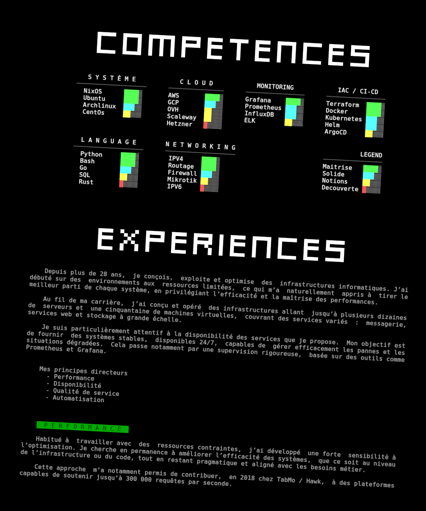

# dockercv

<p align="center">A CV that runs in your terminal</p>



## Viewing this curriculum vitae

### Secure and interactive

View the interactive curriculum vitae from a Docker container.

> [!NOTE]
> This container drops all permissions and runs without networking access.

```bash
docker run -it  --cap-drop=ALL --read-only --network none badele/dockercv
```

### From a web browser

Slightly degraded version (the intro is not supported).

[badele/dockercv](https://badele.github.io/dockercv)

### From Neotex sources

View it in your terminal from the Neotex sources.

```bash
go install github.com/badele/splitans@latest
SPLITANS="$(go env GOPATH)/bin/splitans"
curl -s https://raw.githubusercontent.com/badele/dockercv/refs/heads/main/assets/newspaper/fr/journal.neo | $SPLITANS -f neotex -F ansi -V
curl -s https://raw.githubusercontent.com/badele/dockercv/refs/heads/main/assets/experiences/fr/experiences.neo | $SPLITANS -f neotex -F ansi -V
curl -s https://raw.githubusercontent.com/badele/dockercv/refs/heads/main/assets/projects/fr/projets.neo | $SPLITANS -f neotex -F ansi -V
```

## Tools used

- [neotex](https://github.com/badele/neotex) - My new ANSI format
- [splitans](https://github.com/badele/splitans) - ANSI/Neotex file reader
- [ansi-compositor](https://github.com/badele/ansi-compositor) - ANSI compositor
- [termfolio](https://github.com/badele/termfolio) - ANSI viewer
